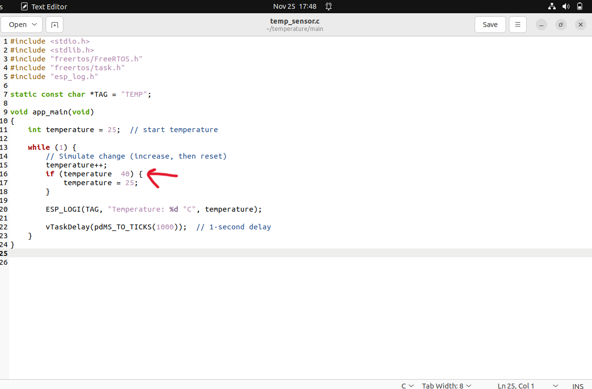

# Temperature Sensor Project — Debugging Reflection

This document summarizes the mistakes, debugging steps, and final resolution during the development of the **simulated temperature sensor** project using **ESP-IDF** and **QEMU for ESP32**.  
It captures what went wrong, why it happened, and how it was fixed.

----------

## 1️⃣ Initial Code Issue — Logical Error in `if()` Condition

The first version of the code contained a **syntax error** inside the `if()` statement:

`if (temperature 40)` 

The compiler expected a comparison operator (`<`, `>`, `==`, etc.), so the build failed.

----------

## 2️⃣ Forgot to Export ESP-IDF Environment

Before building the project, the ESP-IDF environment must be activated:

`. ~/esp-idf-v5.1/export.sh` 

Initially, `idf.py` was not found because this step was skipped.

----------

## 3️⃣ Starting the Build Process

After exporting the environment correctly, the build system (CMake + Ninja) ran and began compiling the project.

----------

## 4️⃣ Compilation Failed — Missing Operator

The build failed with:

`error: expected ')' error: before  numeric  constant` 

This was due to the invalid `if (temperature 40)`.

----------

## 5️⃣ Corrected Code — Fixed Logic and Syntax

After identifying the mistake, the condition was corrected:

`if (temperature < 40) {
    temperature = 25;
}` 

Braces and indentation were also cleaned up to improve clarity.

----------

## 6️⃣ Flashing the Output Image in QEMU

The firmware was rebuilt, merged, padded with `truncate`, and executed in QEMU.

This verified:

-   Build system working
    
-   Flashing steps correct
    
-   Memory layout correct
    

----------

## 7️⃣ Final Output — Working Temperature Logs

Once flashed, the program ran continuously in QEMU, printing stable temperature readings:

`TEMP: Temperature: 25 °C  TEMP: Temperature: 25 °C ...` 

This confirmed the logic and environment setup were fully correct.

----------

# ✔ Key Learnings

### **1. Tiny syntax mistakes break embedded builds**

Missing a single operator (`<`) caused a full compile failure. C compilers are strict and will not guess your intention.

### **2. Exporting ESP-IDF is mandatory**

`idf.py` will not run unless the environment variables and paths are configured for that terminal session.

### **3. QEMU is unforgiving but reliable**

If the binary is correct, QEMU will always execute it consistently.  
If something fails, the issue is always in your code or build steps—not QEMU.

### **4. Consistency matters**

The same workflow (build → merge_bin → truncate → qemu run) works for all projects once understood.