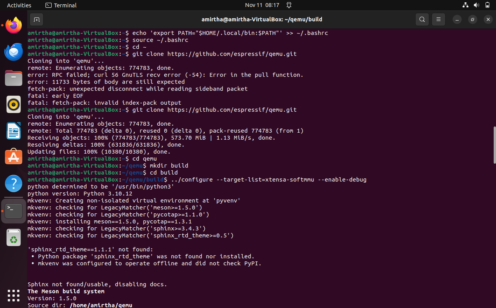
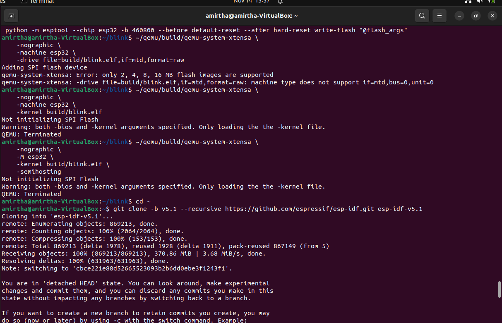

<h1 align="center">
  <br><br>
  ⚡ ESP32 EMULATION USING QEMU & ESP-IDF ⚡
</h1>

<h3 align="center">A Complete Virtual IoT Development Environment — No Hardware Needed 🚀</h3>

<p align="center">
  
  
  
  
</p>


This report documents, step-by-step, how I set up an **ESP32 emulation environment** using:

- **QEMU (Espressif fork)** – to emulate the ESP32 chip  
- **ESP-IDF** – the official ESP32 development framework  

Two applications were developed and run entirely in the emulator:

1. **LED Blink** (GPIO toggle – printed as `LED ON / LED OFF`)  
2. **Temperature Monitor** (simulated temperature values in °C)

The report is written in a **beginner-friendly** way so that anyone familiar with basic Linux can follow the commands and reproduce the setup or use it as a base for **open-source contributions**.

---

## 🟪 **1. System Information**

| Item                     | Details (from commands & logs) |
|--------------------------|---------------------------------|
| Host OS                  | Ubuntu (inside VirtualBox)      |
| Shell                    | Bash                            |
| Python                   | 3.10.12 (`python3 --version`)   |
| ESP-IDF used finally     | **v5.1** (for Blink & Temp)     |
| QEMU version             | **9.2.2** (Espressif fork)      |
| Target MCU               | ESP32                           |

---

## 2. Installing Prerequisite Packages

Before building ESP-IDF and QEMU, I installed all development tools and libraries required.

### 2.1 Install build tools and libraries

```bash
sudo apt install -y git python3 python3-pip cmake make gcc g++ \
  libglib2.0-dev libfdt-dev libpixman-1-dev zlib1g-dev \
  ninja-build flex bison
```
**What this does (line by line):**

-   `git` – required to clone ESP-IDF and QEMU repositories.
    
-   `python3` & `python3-pip` – ESP-IDF tools are Python-based.
    
-   `cmake`, `make`, `gcc`, `g++` – standard C/C++ build tools.
    
-   `libglib2.0-dev`, `libfdt-dev`, `libpixman-1-dev`, `zlib1g-dev` – libraries QEMU needs to build properly.
    
-   `ninja-build` – fast build system used by QEMU and ESP-IDF.
    
-   `flex`, `bison` – parser generators needed by some build steps.
    

📷 **Screenshot 01 – Prerequisite installation**  


----------

### 2.2 Verify key tools

```
python3 -m pip install --user pyserial # serial communication helper git --version
python3 --version
cmake --version
make --version
gcc --version
``` 

This confirms all tools are installed and available in `PATH`.

📷 **Screenshot 02 – Tool verification**  


----------

## 3. Building QEMU (Espressif Fork)

QEMU is a generic emulator. Espressif maintains a fork that adds ESP32 support.

### 3.1 Clone and configure QEMU

```
cd ~
git clone https://github.com/espressif/qemu.git cd qemu mkdir build && cd build # First configure attempt ../configure --target-list=xtensa-softmmu --enable-debug
``` 

-   `git clone …` downloads the QEMU source.
    
-   `mkdir build && cd build` – keeps build files separate from source.
    
-   `--target-list=xtensa-softmmu` – enables the **Xtensa** CPU backend (used by ESP32).
    
-   `--enable-debug` – compiles QEMU with debug symbols.
    

📷 **Screenshot 03 – Clone & first configure**  


----------

### 3.2 Fix 1 – Missing `gcrypt.h`

Running `ninja` initially failed:

`ninja # … fatal error: gcrypt.h: No such file or directory` 

To fix this, I installed the development package:

`sudo apt install -y libgcrypt20-dev` 

📷 **Screenshot 04 – gcrypt.h error**  


----------

### 3.3 Fix 2 – Missing `libslirp.h`

The next `ninja` build stopped with:

`fatal error: libslirp.h: No such file or directory` 

This is a networking library QEMU uses. Fixed by:

`sudo apt install -y libslirp-dev` 

📷 **Screenshot 05 – libslirp error**  


----------

### 3.4 Fix 3 – Python `tomli` missing

Later, while configuring QEMU again, the script reported:

`*** No usable tomli, please install it` 

I installed the missing Python library:

`sudo apt install python3-tomli` 


### 3.5 Successful QEMU configuration & build

After fixing all dependencies, I ran configure again:

```
cd ~/qemu/build
../configure --target-list=xtensa-softmmu --enable-debug
```  

Then built QEMU:

```
ninja
./qemu-system-xtensa --version
``` 

📷 **Screenshot 06 – QEMU built and version displayed**  


At this point, QEMU (with ESP32 support) was ready.

----------

## 4. Installing ESP-IDF

ESP-IDF is the official framework for ESP32. I used **two clones** during experiments (master and v5.1 branch), but the final working setup uses **ESP-IDF v5.1**.

### 4.1 Clone ESP-IDF

```
cd ~
git clone --recursive https://github.com/espressif/esp-idf.git cd esp-idf
``` 

-   `--recursive` fetches all submodules (components, tools, etc.).
    

📷 **Screenshot 07 – ESP-IDF clone**  


----------

### 4.2 Install ESP-IDF tools

`./install.sh` 

This script:

-   Detects Python,
    
-   Downloads the **Xtensa** and **RISC-V** toolchains,
    
-   Installs Python packages required by ESP-IDF.
    

📷 **Screenshot 08 – First ESP-IDF tool installation**  


Later I also cloned the **v5.1 branch** separately (not shown again as code) and ran **another `./install.sh`**, visible here:

----------

## 4.3 Exporting the ESP-IDF Environment (Screenshots 09 & 15)

Before using any ESP-IDF command such as `idf.py build`, the environment must be activated.

### 🔧 Command
```bash
cd ~/esp-idf        # or esp-idf-v5.1 depending on the clone
. ./export.sh       # note the dot and space
idf.py --version    # verify tool availability
```

📝 Explanation

`. ./export.sh` loads ESP-IDF Python virtual environment

Adds toolchain binaries (xtensa compiler) to PATH

Enables idf.py globally

📷 Screenshot 09 – Export & IDF version


### 📌 Screenshot 10 – Editing Blink Application Code

### 🔧 Commands
```bash
cd blink
nano main/main.c
```
📝 Simple Explanation
`cd blink` → open the blink project folder
`nano main/main.c` → edit the main application code


### 📌 Screenshot 11 – Blink Project Build Configuration

### 🔧 Command
```bash
idf.py build
```
### 📝 Simple Explanation
`idf.py build` → starts configuring and compiling the project
(checks toolchain, creates build files)


## The Blink is built up


### 📌 Screenshot 13 – Wrong QEMU Command Attempt

### 🔧 Command
```bash
qemu-system-xtensa -machine esp32 -kernel build/blink.elf
```
### 📝 Simple Explanation

This command is wrong because QEMU cannot run the ELF directly.

ESP32 QEMU needs a flash image (flash.bin), not an ELF file.




### 🔧 Command
```bash
./install.sh
```
### 📝 Simple Explanation
Installs ESP-IDF tools such as compilers, Python packages, and required SDK components.


### 📌 Screenshot 15 – Exporting ESP-IDF v5.1 Environment

### 🔧 Command
```bash
. ~/esp-idf-v5.1/export.sh
```
### 📝 Simple Explanation
Activates ESP-IDF v5.1 environment so idf.py and compilers work properly.


### **5.3 Performing a Full Clean Build**

A full clean build removes all previously generated build files.  
This ensures the project compiles from scratch without using cached artifacts, which is important for reproducibility in open-source workflows.

#### 🔧 Commands Used
```bash
idf.py fullclean
idf.py build
```

### 📝 Simple Explanation
`idf.py fullclean` → deletes the entire build/ directory

`idf.py build` → configures and recompiles everything fresh

### 🖼️ Build Output


    

### **5.4 QEMU Configuration Error – Missing Python Dependency**

During the QEMU configuration step, the build system reported that a required Python package (`tomli`) was missing.  
This error prevents QEMU from generating its build files.

#### 🔧 Command That Triggered the Error
```bash
../configure --target-list=xtensa-softmmu --enable-debug
```
### 📝 Simple Explanation
The QEMU configuration script checks Python dependencies.

It stops when tomli is not installed, which is required by Meson (QEMU’s build tool).

### 🖼️ Error Output


### **5.5 Installing Missing Python Dependency (tomli)**

To fix the QEMU configuration error, the missing Python package `tomli` must be installed.  
This package is required by Meson, the build system used by QEMU.

#### 🔧 Command Used
```bash
sudo apt install python3-tomli
```
### 📝 Simple Explanation
Installs the tomli module system-wide.

After installation, QEMU configuration can proceed without errors.

### 🖼️ Installation Output


### **5.6 Successful QEMU Configuration**

After installing the missing dependency (`tomli`), QEMU’s configuration completed successfully.  
This step prepares all required build files using Meson and verifies the host system setup.

#### 🔧 Command Used
```bash
../configure --target-list=xtensa-softmmu --enable-debug
```
### 📝 Simple Explanation

Configures QEMU for the ESP32 (Xtensa) architecture
Enables debug symbols
Generates build instructions for Ninja
Confirms that all dependencies are now correctly installed

### 🖼️ Configuration Success Output


### **5.7 Incorrect QEMU Kernel Command Attempt**

Before using the correct flash image method, an attempt was made to run the Blink firmware using the `-kernel` option.  
This approach does **not** work for ESP32 because the emulator expects a complete flash layout, not just the ELF file.

#### 🔧 Command Used (Incorrect)
```bash
~/qemu/build/qemu-system-xtensa \
  -machine esp32 \
  -kernel build/blink.elf
```
### 📝 Simple Explanation
-kernel loads a raw kernel image, but ESP32 firmware is not a Linux kernel

QEMU warns that SPI flash is not initialized

The emulator exits immediately

This step documents an early mistake and helps new contributors understand the correct workflow.

### 🖼️ Output Showing Incorrect Usage


## **6. Setting Up the Blink Application Flash Image**
### **6.1 Build Completed but Flash Image Incorrectly Used**

At this stage, the Blink project successfully built, but an incorrect flash image (`blink.bin`) was used when attempting to run QEMU.  
QEMU requires a **merged flash image** created using `esptool.py merge_bin`.

#### 🔧 Command Used (Incorrect Attempt)
```bash
idf.py build # then tried using build/blink.bin directly in QEMU
```
### 📝 Simple Explanation
The build completed successfully, but only produced individual binaries.

QEMU cannot run blink.bin alone—it needs a full flash layout (bootloader + partition table + app).

This screenshot captures the moment before fixing the flash preparation process.

🖼️ Build Output Showing the Issue


### **6.2 ESP-IDF Tools Missing – Reinstallation Required**

While attempting to build again, ESP-IDF reported that some required tools were missing in the Python environment.  
This happens when the ESP-IDF virtual environment is not fully installed or becomes corrupted.

#### 🔧 Command That Triggered the Error
```bash
idf.py build
```
### 📝 Simple Explanation
`idf.py` could not find required tools inside the ESP-IDF v5.1 environment

The environment needed to be reinstalled using install.sh

This is a common issue when switching between multiple ESP-IDF versions

To fix this, ESP-IDF tools were reinstalled in the next step.

### 🖼️ Output Showing Missing Tools


### **6.3 ESP-IDF v5.1 Environment Successfully Exported**

After reinstalling the missing tools, the ESP-IDF v5.1 environment was successfully activated.  
This ensures that all required compilers, Python packages, and paths are correctly set for building ESP32 projects.

#### 🔧 Commands Used
```bash
cd ~/esp-idf-v5.1
. ./export.sh
```
### 📝 Simple Explanation

`cd ~/esp-idf-v5.1` → go to the ESP-IDF v5.1 folder

`. ./export.sh` → activates the ESP-IDF environment

loads the correct Python virtual environment

adds the Xtensa compiler to PATH

enables idf.py

Successfully exporting this environment is necessary before every build.

### 🖼️ Export Success Output


### **6.4 Performing a Fresh Full Clean and Rebuild (Blink Project)**

After fixing the ESP-IDF environment, a clean rebuild was performed to ensure that all components compile correctly from scratch.  
This is important for reproducibility and ensures no old build files cause issues.

#### 🔧 Commands Used
```bash
idf.py fullclean
idf.py build
```
### 📝 Simple Explanation
`idf.py fullclean` → removes all old build files and cached components

`idf.py build`→ configures and rebuilds the entire Blink project cleanly

A successful clean build confirms that:

the environment is fixed

the toolchain works

the Blink code compiles without errors

### 🖼️ Clean Build Output


### **6.5 Creating the Flash Image for QEMU (flash.bin)**

ESP32 firmware cannot run directly as an ELF or a single `.bin` file.  
QEMU requires a **complete flash image** that includes:

- Bootloader  
- Partition Table  
- Application Binary (`blink.bin`)  

These must be merged using `esptool.py`.

#### 🔧 Command Used
```bash
esptool.py --chip esp32 merge_bin -o flash.bin \
  0x1000  build/bootloader/bootloader.bin \
  0x8000  build/partition_table/partition-table.bin \
  0x10000 build/blink.bin
```
### 📝 Simple Explanation
merge_bin → combines multiple binaries into one flash image

0x1000 → bootloader address

0x8000 → partition table address

0x10000 → application start address

Output: flash.bin → required for QEMU

This step prepares a valid ESP32 flash layout for emulation.

### 🖼️ Flash Image Creation Output


### **6.6 First Successful QEMU Boot (Blink Application)**

After preparing the correct `flash.bin`, the Blink firmware was executed in QEMU.  
QEMU successfully initialized the ESP32 bootloader and loaded the firmware just like real hardware.

#### 🔧 Command Used
```bash
~/qemu/build/qemu-system-xtensa \
  -nographic \
  -machine esp32 \
  -drive file=flash.bin,if=mtd,format=raw
```
### 📝 Simple Explanation
-`nographic` → run QEMU in terminal mode

-`machine esp32` → uses Espressif’s ESP32 machine model

-`drive file=flash.bin`→ loads the full flash image

`if=mtd` → specifies memory-tech-device (SPI flash)

`format=raw` → reads the file as a raw flash image

This is the correct way to run ESP32 apps in QEMU.

🖼️ Bootloader & Partition Table Output


### **6.7 Application Startup Inside QEMU (Blink App Running)**

After the bootloader completed, QEMU successfully started the Blink application.  
This section of the log shows the ESP-IDF runtime initializing and calling `app_main()`.

#### 📝 What This Output Shows
- CPU0 & CPU1 start running FreeRTOS  
- ESP-IDF system services are initialized  
- The Blink application is loaded from flash  
- The firmware begins executing on the virtual ESP32  

This confirms that the emulator has fully transitioned from bootloader → application.

#### 🖼️ QEMU Application Start Output


### **6.8 LED Toggle Output in QEMU (Blink Successfully Running)**

Once the Blink firmware entered `app_main()`, it began printing the simulated LED toggle messages in a continuous loop.

#### 📝 What This Output Shows
- The Blink application is running exactly as intended  
- `LED ON` and `LED OFF` messages alternate every 500 ms  
- This mimics real hardware GPIO toggling, but using logs for QEMU  
- Confirms that FreeRTOS task scheduling and delays work correctly  

This is the main proof that the Blink application is successfully running under QEMU.

#### 🖼️ LED Toggle Output


### **6.9 Continuous LED Output (Long-Running Blink Application)**

After starting successfully, the Blink application continues running inside QEMU without errors.  
This screenshot captures the **extended LED ON/OFF output**, proving the firmware behaves normally over time.

#### 📝 What This Output Shows
- The program runs inside QEMU exactly like on a real ESP32  
- FreeRTOS scheduling remains stable over long execution  
- The log shows repeated:
  - `LED ON`
  - `LED OFF`
- There are no crashes or boot loops  

This confirms the Blink firmware is reliable inside the emulator.

#### 🖼️ Long LED Output Log


## **7. Temperature Monitoring Application**
### **7.1 Setting Up the Temperature Project**

A second ESP-IDF application was created to simulate temperature readings.  
This project is based on the default `hello_world` example and modified to print temperature values periodically.

#### 🔧 Commands Used
```bash
cp -r ~/esp-idf-v5.1/examples/get-started/hello_world ~/temperature
cd ~/temperature
. ~/esp-idf-v5.1/export.sh
```
### 📝 Simple Explanation
Copy example project → creates a new folder named temperature

`cd ~/temperature` → enter the project

`export.sh` → activates ESP-IDF so idf.py works

This step prepares the environment before building the temperature firmware.

### 🖼️ Environment Setup Screenshot


### **7.2 Creating the Flash Image and Running Temperature App in QEMU**

After setting up the project, the next step was to build the firmware using `idf.py`.  
During the build, ESP-IDF automatically verifies Python packages, toolchain paths, and component dependencies.

#### 🔧 Command Used
```bash
idf.py build
```
📝 Simple Explanation
`idf.py build` → compiles the temperature project

During the build, ESP-IDF:

checks Python requirements

detects unused tools

verifies toolchain installation

compiles the source code

The build proceeds successfully after environment activation

This confirms the ESP-IDF v5.1 setup is correct and ready for generating firmware.

After building the temperature firmware, all required binaries were merged into a single flash image (`flash.bin`) that QEMU can load.

#### 🔧 Commands Used
```bash
esptool.py --chip esp32 merge_bin -o flash.bin \
  0x1000  build/bootloader/bootloader.bin \
  0x8000  build/partition_table/partition-table.bin \
  0x10000 build/hello_world.bin

truncate -s 4M flash.bin
```
### 📝 Simple Explanation
`merge_bin`→ combines bootloader + partition table + app

`truncate -s 4M` → QEMU requires a 4 MB flash file

This produces a QEMU-compatible flash image

Then the firmware was executed in QEMU:

```
~/qemu/build/qemu-system-xtensa \
  -nographic \
  -machine esp32 \
  -drive file=flash.bin,if=mtd,format=raw
  ```
QEMU boots the ESP32 just like real hardware

Loads bootloader → partition table → application


### 🖼️ Build Output Screenshot


### 🖼️ Flash Merge + QEMU Boot Output


### **7.4 Temperature Readings in QEMU (Application Running Successfully)**

Once the temperature firmware started running, QEMU continuously printed simulated temperature values.  
This verifies that the application logic, FreeRTOS timing, and logging all work correctly inside the emulator.

#### 📝 What This Output Shows
- ESP-IDF initialized successfully  
- Application `app_main()` is running  
- Temperature values are printed every second  
- Readings vary between **26°C to 40°C** (simulated)  
- QEMU runs the program stably without crashes  

This confirms the temperature application behaves exactly like expected on an actual ESP32 board.

#### 🖼️ Long Temperature Output Log


## 8. Learnings 

From this exercise, I learned:

-   How to set up a **complete ESP32 toolchain** on Linux using ESP-IDF.
    
-   How to build and debug **QEMU (Espressif fork)** and understand its dependency chain.
    
-   The **binary layout** of ESP32 flash (bootloader, partition table, app offset).
    
-   How to convert a normal ESP-IDF project build into a QEMU-compatible **flash image**.
    
-   How FreeRTOS-based apps (`app_main()`, tasks, logs) behave when emulated.
    
-   How to systematically debug build and runtime issues (missing packages, wrong options).
    

These skills are directly relevant when:

-   Contributing to **ESP-IDF examples or tools**,
    
-   Working on **QEMU/ESP32 support**,
    
-   Or building **automated CI pipelines** where firmware is tested in QEMU instead of on real boards.
    

----------

## 9. Potential Use in Platforms like Yaksh

With this setup:

-   Student submissions (Blink, sensor code, etc.) can be compiled using `idf.py`.
    
-   The generated `flash.bin` can be **executed in QEMU**.
    
-   Scripts can capture the console output and automatically test:
    
    -   Whether temperature prints are in a valid range,
        
    -   Whether LED toggles happen periodically, etc.
        

This removes the need for physical ESP32 hardware while still keeping behavior close to real devices.

----------

## 10. Conclusion

This report demonstrated, step by step:

1.  Installing all Linux prerequisites for ESP-IDF and QEMU.
    
2.  Building Espressif’s QEMU with proper dependencies.
    
3.  Installing and configuring ESP-IDF v5.1.
    
4.  Creating, building and **successfully emulating**:
    
    -   A **Blink** application (LED ON/OFF logs).
        
    -   A **Temperature monitor** application (simulated °C readings).
        
5.  Documenting every issue encountered and its fix.
    

With the commands and screenshots provided, **any beginner** should be able to:

-   Reproduce the environment,    
-   Understand what each command does, and
-   Use this setup as a foundation for further open-source contributions to ESP-IDF and ESP32 emulation.
